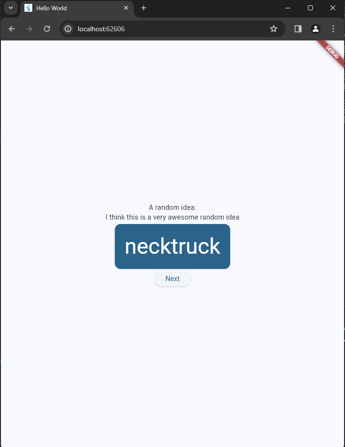
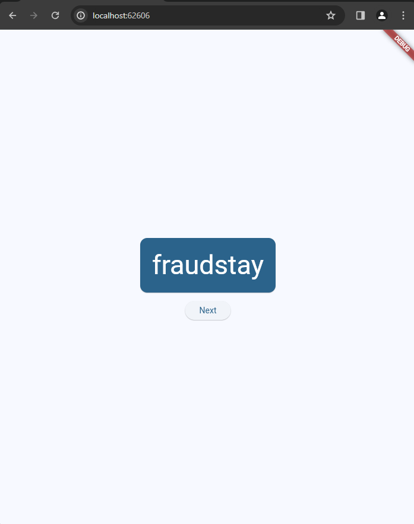

# Hello World Flutter App


This is a simple Flutter app that generates random word pairings and allows users to generate a new word pairing by pressing a button.

My first app built in Flutter.

### Screenshots





### Getting Started

### Prerequisites
- [Flutter SDK](https://flutter.dev/docs/get-started/install)
- [VS Code](https://code.visualstudio.com/)

### Installation

```json
1. Clone the repository:
   git clone https://github.com/csabika98/hello_world_flutter.git
```
```json
2. Navigate to the project directory:
   cd hello_world_flutter
```

```json
3. Get the dependencies:
   flutter pub get
```

### Launching the App

```json
1. Open `lib/main.dart` in VS Code.
```
```json
2. Select your target device in the bottom right corner of VS Code.
```
```json
3. Click the "play" button in the upper right-hand corner of VS Code.
```
```json
4. The app will launch in debug mode.
```

# Changelog

### Adding a Button

1. Add the following button code to `lib/main.dart`:
```java
   ElevatedButton(
     onPressed: () {
       appState.getNext();
     },
     child: Text('Next'),
   );
```

2. Save the file. The app will update with a new button.

### Hot Reload
1. Modify the string in the first `Text` widget:
   Text('A random AWESOME idea:'),
2. Save the file to see the changes immediately.

### State Management
```java
1. Add a `getNext` method in `MyAppState`:
   void getNext() {
     current = WordPair.random();
     notifyListeners();
   }
```
2. Update the button's `onPressed` callback to call `getNext()`:
```java
    onPressed: () {
     appState.getNext();
   },
```
### UI Enhancements

1. Extract the word pair display into a separate widget `BigCard`.


2. Wrap the `BigCard` with `Padding` and `Card` widgets for better styling.

3. Apply a theme to the card and text:
```java
 
   final theme = Theme.of(context);
   final style = theme.textTheme.displayMedium!.copyWith(
     color: theme.colorScheme.onPrimary,
   );
```
### Accessibility
1. Improve screen reader support by setting the `semanticsLabel`:
```
   semanticsLabel: "${pair.first} ${pair.second}",
```

### Center the UI
1. Center the contents vertically and horizontally using `mainAxisAlignment` and `Center` widget:
```
   mainAxisAlignment: MainAxisAlignment.center,
```
### Final Code Example

```java
class MyHomePage extends StatelessWidget {
  @override
  Widget build(BuildContext context) {
    var appState = context.watch<MyAppState>();
    var pair = appState.current;

    return Scaffold(
      body: Center(
        child: Column(
          mainAxisAlignment: MainAxisAlignment.center,
          children: [
            BigCard(pair: pair),
            SizedBox(height: 10),
            ElevatedButton(
              onPressed: () {
                appState.getNext();
              },
              child: Text('Next'),
            ),
          ],
        ),
      ),
    );
  }
}
```
## Additional Resources
- [Flutter Documentation](https://flutter.dev/docs)
- [Provider Package Documentation](https://pub.dev/packages/provider)
